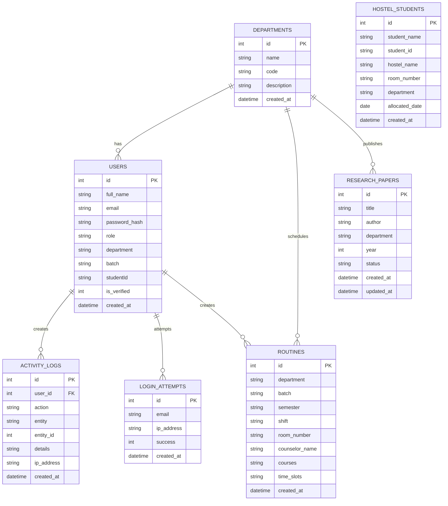
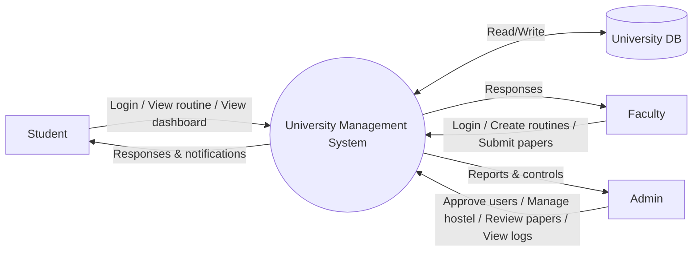
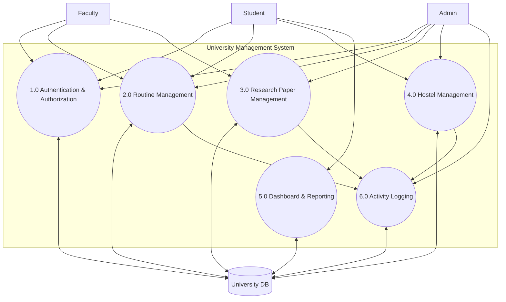
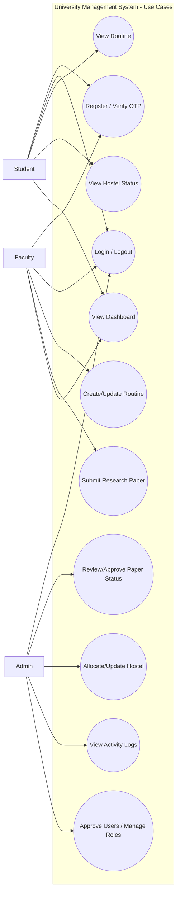

# University Management System - Complete Database Architecture Report

**Date:** February 1, 2026  
**Project:** University Management System (Database Management System)  
**Type:** Full-Stack Educational Management Platform  
**Focus:** Database Architecture & Design

---

## Abstract

The **University Management System** is a full-stack database-driven platform designed to digitize and streamline core university operations such as user registration, role-based access, class routine management, research paper tracking, hostel allocations, and audit logging. This system was built to replace fragmented, manual workflows (paper files, spreadsheets, and disconnected tools) that often cause delays, duplication, data inconsistency, weak security, and limited reporting. By centralizing academic and administrative data in a structured DBMS and exposing it through secure REST APIs, the platform enables students, faculty, and administrators to access accurate information quickly and perform tasks with proper authorization. The project uses **Node.js + Express.js** for backend services, **React.js** for the frontend UI, and a flexible database layer that supports **SQLite (development)** and **MySQL (production via XAMPP)**. Security features include **OTP email verification**, **JWT authentication**, password hashing with **bcrypt**, account lockout on repeated failures, and **activity logging** for accountability. Expected outcomes include faster routine publishing, improved transparency, secure access to services, and a scalable foundation for future modules.

## 📋 Table of Contents

1. [Abstract](#abstract)
2. [Executive Summary](#executive-summary)
3. [Problem Statement](#problem-statement)
4. [Objectives](#objectives)
5. [Scope of the Project](#scope-of-the-project)
6. [Methodology](#methodology)
7. [Project Overview](#project-overview)
8. [Architecture Overview](#architecture-overview)
9. [Technology Stack](#technology-stack)
10. [Database System Architecture](#database-system-architecture)
11. [Complete Database Schema](#complete-database-schema)
12. [Data Models & Relationships](#data-models--relationships)
13. [Module-Wise Breakdown](#module-wise-breakdown)
14. [API Architecture](#api-architecture)
15. [Security & Authentication](#security--authentication)
16. [ER Diagram (Graphical)](#er-diagram-graphical)
17. [Data Flow Diagrams](#data-flow-diagrams)
18. [Use Case Diagram](#use-case-diagram)
19. [Business Logic & Workflows](#business-logic--workflows)
20. [Frontend Architecture](#frontend-architecture)
21. [Screenshots of the System](#screenshots-of-the-system)
22. [Deployment & Configuration](#deployment--configuration)
23. [Conclusion & Future Enhancements](#conclusion--future-enhancements)

---

## Executive Summary

The **University Management System** is a comprehensive database management platform designed for educational institutions. It manages multiple complex operations including student information, course routines, research papers, hostel allocations, and academic tracking. 

**Key Characteristics:**
- **Type**: Full-Stack Web Application (Backend + Frontend)
- **Primary Focus**: Database Management & Storage
- **Database Technology**: SQLite (Development) / MySQL (Production via XAMPP)
- **Backend**: Express.js (Node.js)
- **Frontend**: React.js
- **Architecture Pattern**: Monorepo with abstraction layer for database flexibility

---

## Problem Statement

Universities manage large volumes of interconnected data such as student profiles, departmental information, class routines, research activities, hostel allocations, and administrative actions. In many institutions, these processes are handled through manual methods (paper documents, Excel sheets, and isolated tools), which leads to common issues: duplicate records, inconsistent updates, difficulty tracking historical changes, slow information retrieval, weak access control, and limited transparency for stakeholders. Manual systems also fail to provide audit trails and are vulnerable to human errors, unauthorized edits, and loss of records. As operations scale, coordinating across departments becomes increasingly complex without a centralized database and standardized workflows. Therefore, a digital DBMS-backed system is needed to ensure data integrity, enable secure role-based access, support real-time reporting, and reduce operational overhead by automating routine administrative and academic tasks.

---

## Objectives

- Develop a centralized university information management system using a structured DBMS.
- Implement secure authentication and authorization using OTP verification and JWT-based sessions.
- Provide dynamic routine creation, storage, and batch/department filtering for student schedules.
- Manage research paper submissions with a clear status workflow (Draft → Under Review → Published/Rejected).
- Manage hostel allocations with uniqueness constraints and searchable allocation records.
- Maintain an activity logging and audit trail mechanism for accountability and troubleshooting.
- Ensure a scalable database architecture with a database abstraction layer to support SQLite and MySQL.

---

## Scope of the Project

### In Scope

- User registration, login, OTP email verification, password reset, and role-based access control.
- Academic routine management (create, list, filter, update, delete) with JSON-based schedule storage.
- Research paper management with status update workflow and admin oversight.
- Hostel allocation management (allocate, view, update, remove) with search and reporting queries.
- Dashboard reporting for student academic, hostel, and account-related summaries.
- Activity logging for key operations and administrative actions.
- Database initialization and seed data for development (SQLite) and support for MySQL deployment.

### Out of Scope (Current Version)

- Full attendance management (daily attendance, biometric integration, attendance analytics).
- Real online payment processing (payment gateway integration and reconciliation).
- Full course registration with prerequisite enforcement and seat capacity management.
- Advanced HR/payroll modules for teachers and staff.
- Mobile app (Android/iOS) and push notification infrastructure.

---

## Methodology

### SDLC Approach

An **Agile, iterative development** approach was followed. The system was built in modules (Authentication → Routines → Research Papers → Hostel → Dashboard → Activity Logs), with repeated cycles of implementation, testing, feedback, and refinement.

### Tools and Technologies Used

- **Backend**: Node.js, Express.js, JWT, bcryptjs, nodemailer
- **Frontend**: React.js, React Router, Fetch API
- **Database**: SQLite (better-sqlite3) for development, MySQL (mysql2) for production
- **Development Workflow**: npm scripts, environment variables via dotenv, Git for version control

### Architecture Planning

- Used a **monorepo** structure with clear separation of concerns (routes, controllers, middleware, services).
- Designed a **database abstraction layer** (`config/db.js`) to switch between SQLite and MySQL without changing controller logic.
- Defined schemas with constraints and indexes to ensure **integrity**, **security**, and **performance**.

## Project Overview

### What is Built

The system is a complete university management platform that handles:

1. **User Management**
   - Student registration and profiles
   - Faculty accounts
   - Administrative accounts
   - Role-based access control

2. **Academic Management**
   - Class routines/schedules
   - Course information
   - Student results and CGPA tracking
   - Research paper submissions and tracking

3. **Infrastructure Management**
   - Hostel student allocations
   - Room assignments
   - Department management

4. **Support Systems**
   - Activity logging and audit trails
   - Notices and announcements
   - Payment/account management

### How It's Made

**Architecture Pattern:**
```
┌─────────────────────────────────────────────────────┐
│              React Frontend (Port 3001)              │
│           - Functional Components with Hooks         │
│           - Material-inspired UI with Gradients     │
│           - Proxies API requests to :3000           │
└────────────────┬────────────────────────────────────┘
                 │
              ├─ HTTP/REST
                 │
┌────────────────▼────────────────────────────────────┐
│         Express.js Backend (Port 3000)               │
│  ┌─────────────────────────────────────────────┐    │
│  │  Routes (authRoutes, routineRoutes, etc.)   │    │
│  │  └─ Middleware (verifyToken, requireRole)   │    │
│  └─────────────────────────────────────────────┘    │
│                      │                              │
│  ┌─────────────────────────────────────────────┐    │
│  │  Controllers (Business Logic)                │    │
│  │  └─ authController, routineController, etc. │    │
│  └─────────────────────────────────────────────┘    │
│                      │                              │
│  ┌─────────────────────────────────────────────┐    │
│  │  Database Abstraction Layer (config/db.js)  │    │
│  │  └─ Switches between SQLite & MySQL         │    │
│  └─────────────────────────────────────────────┘    │
└────────────────┬────────────────────────────────────┘
                 │
        ┌────────┴────────┐
        │                 │
┌───────▼────────┐  ┌────▼──────────────┐
│  SQLite (Dev)  │  │ MySQL via XAMPP   │
│  university.db │  │ (Production)      │
└────────────────┘  └───────────────────┘
```

---

## Architecture Overview

### Monorepo Structure

```
University-System-Management/
├── server.js                      # Main Express server
├── config/
│   ├── db.js                     # Database abstraction (SQLite/MySQL switch)
│   ├── sqliteDb.js               # SQLite configuration with schema
│   └── mysqlDb.js                # MySQL configuration (XAMPP)
├── controllers/                  # Business logic layer
│   ├── authController.js         # Authentication & Authorization
│   ├── routineController.js      # Class schedules
│   ├── researchPaperController.js
│   ├── hostelController.js
│   ├── dashboardController.js
│   ├── departmentController.js
│   ├── courseController.js
│   └── activityLogController.js
├── routes/                       # API endpoints
│   ├── authRoutes.js
│   ├── routineRoutes.js
│   ├── researchPaperRoutes.js
│   ├── hostelRoutes.js
│   ├── departmentRoutes.js
│   ├── dashboardRoutes.js
│   └── adminRoutes.js
├── middleware/                   # Authentication & authorization
│   └── authMiddleware.js         # JWT verification & role checks
├── data/                         # Static data & seeds
│   ├── departments.js            # Department hierarchies
│   ├── cseTeachers.js
│   ├── civilTeachers.js
│   ├── eeeTeachers.js
│   ├── bbaTeachers.js
│   └── ... (more department teachers)
├── services/                     # Utility services
│   └── emailService.js           # OTP & password reset emails
├── utils/                        # Helper functions
│   └── responseHandler.js        # Standardized API responses
├── frontend/                     # React Frontend (Port 3001)
│   ├── public/
│   ├── src/
│   │   ├── components/           # React components
│   │   ├── pages/                # Page components
│   │   ├── config/               # Frontend config
│   │   ├── App.js
│   │   └── index.js
│   └── package.json
└── university.db                 # SQLite database file (auto-created)
```

---

## Technology Stack

### Backend Stack
| Technology | Purpose | Version |
|-----------|---------|---------|
| **Node.js** | JavaScript runtime | Latest |
| **Express.js** | Web framework | 4.18.2 |
| **better-sqlite3** | SQLite driver (sync) | 12.6.2 |
| **mysql2** | MySQL driver | 3.6.5 |
| **jsonwebtoken** | JWT authentication | 9.0.3 |
| **bcryptjs** | Password hashing | 3.0.3 |
| **nodemailer** | Email service | 7.0.12 |
| **body-parser** | JSON parsing | 1.20.2 |
| **cors** | Cross-origin requests | 2.8.5 |
| **dotenv** | Environment variables | 16.6.1 |
| **nodemon** | Auto-restart (dev) | 3.0.2 |

### Frontend Stack
| Technology | Purpose | Version |
|-----------|---------|---------|
| **React** | UI framework | 18.2.0 |
| **React Router** | Client-side routing | 6.20.0 |
| **jsPDF** | PDF generation | 4.0.0 |
| **jsPDF AutoTable** | PDF table plugin | 5.0.7 |

### Database Technologies
| Type | Database | Use Case |
|------|----------|----------|
| **Development** | SQLite (better-sqlite3) | Fast development, file-based |
| **Production** | MySQL (via XAMPP) | Enterprise deployment |

---

## Database System Architecture

### Database Abstraction Layer

The project implements a **smart database abstraction pattern** that allows switching between SQLite and MySQL without changing controller code.

**File: `config/db.js`**
```javascript
// Choose your database:
const mysqlDb = require('./mysqlDb');  // Uncomment for MySQL/XAMPP
module.exports = mysqlDb;

// OR use SQLite:
// const sqliteDb = require('./sqliteDb');
// module.exports = sqliteDb;
```

### Why This Pattern?

| Benefit | Explanation |
|---------|-------------|
| **Flexibility** | Easy switch between development (SQLite) and production (MySQL) |
| **Consistency** | All controllers use same `db.query()` interface |
| **Maintainability** | No duplicate logic across database types |
| **Scalability** | Can add new database drivers without changing existing code |

### SQLite Implementation Details

**File: `config/sqliteDb.js`**

SQLite provides synchronous operations, so a wrapper creates an async MySQL-compatible API:

```javascript
// MySQL-like async wrapper for SQLite
const queryWrapper = {
  query: (sql, params = []) => {
    return new Promise((resolve, reject) => {
      try {
        if (sql.toUpperCase().startsWith('SELECT')) {
          const rows = db.prepare(sql).all(params);
          resolve([rows, []]);  // Returns [rows, fields] like MySQL
        } else if (sql.toUpperCase().startsWith('INSERT')) {
          const result = db.prepare(sql).run(params);
          resolve([{ insertId: result.lastInsertRowid }, []]);
        }
        // ... UPDATE and DELETE handled similarly
      } catch (error) {
        reject(error);
      }
    });
  }
};
```

This ensures controllers use consistent async/await patterns regardless of database backend.

---

## Complete Database Schema

### 1. **USERS Table**
**Purpose**: Store all user accounts with authentication data

```sql
CREATE TABLE users (
  id INTEGER PRIMARY KEY AUTOINCREMENT,
  full_name TEXT NOT NULL,
  email TEXT NOT NULL UNIQUE,
  password_hash TEXT NOT NULL,              -- bcrypt hashed
  role TEXT NOT NULL DEFAULT 'pending',     -- pending|student|faculty|admin
  department TEXT,
  designation TEXT,
  batch TEXT,                               -- Format: D-78A, E-100, etc.
  studentId TEXT,
  is_verified INTEGER DEFAULT 0,            -- 0 = unverified, 1 = verified
  otp TEXT,                                 -- One-Time Password for email verification
  otp_expiry DATETIME,                      -- OTP expires after 10 minutes
  reset_token TEXT,                         -- Password reset token
  reset_token_expiry DATETIME,              -- Reset token expires after 30 minutes
  failed_login_attempts INTEGER DEFAULT 0,  -- Increments on failed login
  last_failed_login DATETIME,               -- Timestamp of last failed attempt
  account_locked_until DATETIME,            -- Account locked if >5 failed attempts
  created_at DATETIME DEFAULT CURRENT_TIMESTAMP
);
```

**Key Attributes:**
- **role**: Determines user's permissions (student can view routines, faculty can create routines, admin manages all)
- **batch**: DIU format batch code (e.g., "D-78A" = Department batch A)
- **studentId**: Unique student identifier (e.g., "CS2024001")
- **Account Lockout**: After 5 failed login attempts, account locked for 15 minutes

**Use Cases:**
- Student login
- Faculty account management
- Admin authentication
- Password recovery

---

### 2. **LOGIN_ATTEMPTS Table**
**Purpose**: Track all login attempts for security auditing

```sql
CREATE TABLE login_attempts (
  id INTEGER PRIMARY KEY AUTOINCREMENT,
  email TEXT NOT NULL,
  ip_address TEXT,
  success INTEGER DEFAULT 0,               -- 0 = failed, 1 = success
  created_at DATETIME DEFAULT CURRENT_TIMESTAMP
);
```

**Attributes:**
- **email**: User attempting to login
- **ip_address**: Source IP for fraud detection
- **success**: Boolean flag for attempt result
- **created_at**: Timestamp for audit trail

---

### 3. **ROUTINES Table**
**Purpose**: Store class schedules in DIU format

```sql
CREATE TABLE routines (
  id INTEGER PRIMARY KEY AUTOINCREMENT,
  department TEXT NOT NULL,                -- CSE, EEE, BBA, etc.
  batch TEXT NOT NULL,                     -- D-78A, D-78B, E-100, etc.
  semester TEXT NOT NULL,                  -- 1, 2, 3, etc.
  shift TEXT NOT NULL,                     -- Morning, Afternoon, Evening
  students_count INTEGER,                  -- Number of students in this batch
  room_number TEXT,                        -- Assigned class room
  counselor_name TEXT,                     -- Academic advisor
  counselor_contact TEXT,
  courses TEXT NOT NULL,                   -- JSON array of course objects
  time_slots TEXT NOT NULL,                -- JSON object with day-wise schedules
  academic_year TEXT,                      -- e.g., "2023-2024"
  effective_from DATE,                     -- When this routine starts
  created_at DATETIME DEFAULT CURRENT_TIMESTAMP
);
```

**Key Attributes:**
- **courses**: JSON array storing course information
  ```json
  [
    {"code": "CSE101", "title": "Database Systems", "credits": 3},
    {"code": "CSE102", "title": "Web Development", "credits": 3}
  ]
  ```
- **time_slots**: JSON object with day-wise time allocations
  ```json
  {
    "Monday": ["09:00-10:30", "11:00-12:30"],
    "Tuesday": ["14:00-15:30"],
    "Wednesday": ["09:00-10:30"]
  }
  ```

**Relationships:**
- Links to **departments** (via department name)
- Links to **users** (via counselor reference)
- Filters by **batch** for student-specific schedules

---

### 4. **RESEARCH_PAPERS Table**
**Purpose**: Track research paper submissions with workflow

```sql
CREATE TABLE research_papers (
  id INTEGER PRIMARY KEY AUTOINCREMENT,
  title TEXT NOT NULL,
  author TEXT NOT NULL,                    -- Faculty name
  department TEXT NOT NULL,                -- Research department
  year INTEGER NOT NULL,
  status TEXT NOT NULL DEFAULT 'Draft',    -- Draft|Under Review|Published|Rejected
  created_at DATETIME DEFAULT CURRENT_TIMESTAMP,
  updated_at DATETIME DEFAULT CURRENT_TIMESTAMP
);
```

**Status Workflow:**
```
Draft → Under Review → Published
         ↓
      Rejected
```

**Attributes:**
- **status**: Workflow state for paper review process
- **year**: Publication year
- **author**: Faculty member who wrote the paper

---

### 5. **HOSTEL_STUDENTS Table**
**Purpose**: Manage student hostel allocations

```sql
CREATE TABLE hostel_students (
  id INTEGER PRIMARY KEY AUTOINCREMENT,
  student_name TEXT NOT NULL,
  student_id TEXT NOT NULL UNIQUE,         -- e.g., "CS2024001"
  hostel_name TEXT NOT NULL,               -- North Hall, South Hall, etc.
  room_number TEXT NOT NULL,               -- e.g., "A-101", "B-205"
  department TEXT NOT NULL,
  allocated_date DATE NOT NULL,            -- When student was allocated
  created_at DATETIME DEFAULT CURRENT_TIMESTAMP
);
```

**Key Constraints:**
- **UNIQUE(student_id)**: Each student can only have one hostel allocation
- **Composite Key Concept**: student_id + hostel_name + room_number identifies a unique allocation

**Attributes:**
- **allocated_date**: Used for tracking allocation history
- **room_number**: Enables room-level tracking for occupancy

---

### 6. **DEPARTMENTS Table**
**Purpose**: Store department master data

```sql
CREATE TABLE departments (
  id INTEGER PRIMARY KEY AUTOINCREMENT,
  name TEXT NOT NULL UNIQUE,               -- Full department name
  code TEXT NOT NULL UNIQUE,               -- Department code (CSE, EEE, etc.)
  description TEXT,                        -- Department description
  created_at DATETIME DEFAULT CURRENT_TIMESTAMP
);
```

**Example Data:**
| id | name | code | description |
|----|------|------|-------------|
| 1 | Computer Science & Engineering | CSE | Department of Computer Science |
| 2 | Electrical & Electronic Engineering | EEE | Department of Electrical Engineering |
| 3 | Business Administration | BBA | Department of Business Studies |

**Purpose:**
- Master data for department references
- Maintains hierarchical structure
- Supports dropdown lists in frontend

---

### 7. **TEACHERS Table**
**Purpose**: Store faculty information

```sql
CREATE TABLE teachers (
  id INTEGER PRIMARY KEY AUTOINCREMENT,
  name TEXT NOT NULL,
  designation TEXT NOT NULL,               -- Professor, Associate Professor, Lecturer
  department TEXT NOT NULL,                -- References department name
  email TEXT,
  phone TEXT,
  specialization TEXT,                     -- e.g., "Machine Learning", "Database Systems"
  image TEXT,                              -- URL or file path to teacher photo
  created_at DATETIME DEFAULT CURRENT_TIMESTAMP
);
```

**Attributes:**
- **designation**: Hierarchical faculty levels
- **specialization**: Area of expertise (enables subject assignment)
- **image**: Profile picture for frontend display

---

### 8. **ACTIVITY_LOGS Table**
**Purpose**: Complete audit trail for all actions

```sql
CREATE TABLE activity_logs (
  id INTEGER PRIMARY KEY AUTOINCREMENT,
  user_id INTEGER NOT NULL,                -- References users(id)
  action TEXT NOT NULL,                    -- CREATE, UPDATE, DELETE, LOGIN, etc.
  entity TEXT NOT NULL,                    -- routines, research_papers, hostel, etc.
  entity_id INTEGER,                       -- ID of the affected record
  details TEXT,                            -- JSON details of the change
  ip_address TEXT,                         -- Source IP for security
  created_at DATETIME DEFAULT CURRENT_TIMESTAMP,
  FOREIGN KEY (user_id) REFERENCES users(id) ON DELETE CASCADE
);
```

**Purpose:**
- **Audit Trail**: Track all changes for compliance
- **Security**: Monitor who did what and when
- **Debugging**: Trace data modifications

**Indexes for Performance:**
```sql
CREATE INDEX idx_activity_user ON activity_logs(user_id);
CREATE INDEX idx_activity_action ON activity_logs(action);
CREATE INDEX idx_activity_entity ON activity_logs(entity);
CREATE INDEX idx_activity_created ON activity_logs(created_at);
```

---

### Optional Tables (Implemented)

#### STUDENT_RESULTS Table
```sql
CREATE TABLE student_results (
  id INTEGER PRIMARY KEY,
  studentId TEXT UNIQUE,
  cgpa FLOAT,                   -- Cumulative GPA
  credits_completed INTEGER,
  ...
);
```

#### STUDENT_ACCOUNTS Table
```sql
CREATE TABLE student_accounts (
  id INTEGER PRIMARY KEY,
  studentId TEXT UNIQUE,
  payable FLOAT,
  paid FLOAT,
  due FLOAT,
  ...
);
```

#### PAYMENT_HISTORY Table
```sql
CREATE TABLE payment_history (
  id INTEGER PRIMARY KEY,
  studentId TEXT,
  amount FLOAT,
  payment_date DATETIME,
  ...
);
```

---

## Data Models & Relationships

## ER Diagram (Graphical)

The following Mermaid ER diagram represents the key entities, primary keys, and core relationships used by the system.



### Entity-Relationship Diagram

```
┌─────────────────────┐         ┌──────────────────────┐
│      users          │         │    departments       │
├─────────────────────┤         ├──────────────────────┤
│ id (PK)             │◄────────│ id (PK)              │
│ full_name           │    1:N  │ name                 │
│ email               │         │ code                 │
│ password_hash       │         │ description          │
│ role                │         └──────────────────────┘
│ department (FK)     │
│ batch               │
│ studentId           │
│ ...                 │
└─────────────────────┘
         │ 1
         │ (author)
         │ (counselor)
         │ N
┌────────▼──────────────────┐         ┌──────────────────┐
│    routines                │         │    routines      │
├────────────────────────────┤         ├──────────────────┤
│ id (PK)                    │         │ id (PK)          │
│ department (FK)            │◄────────│ department       │
│ batch                      │    1:1  │ courses (JSON)   │
│ semester                   │         │ time_slots (JSON)│
│ counselor_name (FK)        │         │ ...              │
│ courses (JSON)             │         └──────────────────┘
│ time_slots (JSON)          │
└────────────────────────────┘

┌──────────────────────────────┐
│  research_papers             │
├──────────────────────────────┤
│ id (PK)                      │
│ title                        │
│ author (FK to users)         │
│ department (FK)              │
│ year                         │
│ status (workflow)            │
└──────────────────────────────┘

┌──────────────────────────────┐
│  hostel_students             │
├──────────────────────────────┤
│ id (PK)                      │
│ student_id (FK to users)     │
│ hostel_name                  │
│ room_number                  │
│ allocated_date               │
└──────────────────────────────┘

┌──────────────────────────────┐
│  activity_logs               │
├──────────────────────────────┤
│ id (PK)                      │
│ user_id (FK)                 │
│ action                       │
│ entity                       │
│ entity_id                    │
│ created_at                   │
└──────────────────────────────┘
```

### Key Relationships

1. **users → departments** (Many-to-One)
   - Multiple users belong to same department
   - Used for: Filtering staff by department

2. **users → routines** (One-to-Many via counselor_name)
   - Faculty counselor creates routines
   - Each routine assigned to one counselor

3. **routines → departments** (Many-to-One)
   - Multiple routines per department
   - Used for: Batch-wise schedule management

4. **research_papers → users** (Many-to-One)
   - Faculty can write multiple papers
   - Author tracked via user_id

5. **hostel_students → users** (One-to-One)
   - Each student has at most one hostel allocation
   - Unique constraint on student_id

6. **activity_logs → users** (Many-to-One)
   - All user actions logged
   - Foreign key ensures referential integrity

---

## Module-Wise Breakdown

### 1. **Authentication Module**

#### Files Involved:
- `controllers/authController.js` - Core logic
- `routes/authRoutes.js` - API endpoints
- `middleware/authMiddleware.js` - JWT verification
- `config/db.js` - User data persistence

#### Key Features:

**A. User Registration**
```javascript
// POST /api/auth/register
// Body: { full_name, email, password, role, studentId, department, batch }
// Process:
// 1. Validate email format
// 2. Check password strength (8+ chars, uppercase, lowercase, number, special)
// 3. Hash password with bcrypt
// 4. Insert into users table with role='pending'
// 5. Send OTP email for verification
// 6. Return success message
```

**B. Email Verification**
```javascript
// POST /api/auth/verify-otp
// Body: { email, otp }
// Process:
// 1. Query users table for OTP match
// 2. Check OTP expiry (10 minutes)
// 3. If valid, set is_verified=1
// 4. Return verification success
// 5. Frontend stores token in localStorage
```

**C. User Login**
```javascript
// POST /api/auth/login
// Body: { email, password }
// Process:
// 1. Query users table by email
// 2. Compare password hash using bcrypt
// 3. Check account lock status (5 failed attempts = 15 min lock)
// 4. If password correct:
//    - Reset failed_login_attempts to 0
//    - Generate JWT token with user data
//    - Return token to frontend
// 5. If password wrong:
//    - Increment failed_login_attempts
//    - If attempts >= 5, set account_locked_until = now + 15 min
//    - Return error message
// 6. Log attempt in login_attempts table
```

**D. Password Reset Flow**
```javascript
// Step 1: POST /api/auth/forgot-password
// Body: { email }
// - Generate reset token
// - Set reset_token_expiry = now + 30 minutes
// - Send email with reset link

// Step 2: POST /api/auth/reset-password
// Body: { email, reset_token, new_password }
// - Verify reset_token and expiry
// - Validate password strength
// - Hash new password
// - Update users table
// - Send confirmation email
```

#### Database Operations:

**Schema Used:**
- `users` table: All authentication data
- `login_attempts` table: Security audit trail

**Key Queries:**
```sql
-- Check if email exists
SELECT * FROM users WHERE email = ?

-- Verify credentials
SELECT password_hash, role FROM users WHERE email = ?

-- Update password
UPDATE users SET password_hash = ? WHERE email = ?

-- Check OTP
SELECT * FROM users WHERE email = ? AND otp = ? AND otp_expiry > NOW()
```

---

### 2. **Routine Management Module**

#### Files Involved:
- `controllers/routineController.js` - Business logic
- `routes/routineRoutes.js` - API endpoints
- Database: `routines` table

#### Key Features:

**A. Create Routine (Faculty/Admin Only)**
```javascript
// POST /api/routines
// Required: { department, batch, semester, shift, courses, time_slots }
// Optional: { room_number, counselor_name, academic_year, effective_from }
// Process:
// 1. Verify user has faculty/admin role
// 2. Validate required fields
// 3. Convert courses array to JSON string
// 4. Convert time_slots object to JSON string
// 5. Insert into routines table
// 6. Log action in activity_logs
// 7. Return inserted routine with ID
```

**B. Get Routines with Filtering**
```javascript
// GET /api/routines?page=1&limit=20&department=CSE&batch=D-78A&semester=1
// Features:
// - Pagination: Default 20 items per page
// - Filters:
//   * By department (CSE, EEE, BBA, etc.)
//   * By batch (D-78A, E-100, etc.)
//   * By semester
// - Search: By course name or counselor
// - Returns count for pagination UI
```

**C. Student-Specific Routine Retrieval**
```javascript
// GET /api/routines/student/:batch
// Process:
// 1. Extract student's batch from JWT token
// 2. Query routines WHERE batch = student_batch
// 3. Parse JSON fields (courses, time_slots)
// 4. Return formatted routine with:
//    - Day-wise schedule
//    - Course list with credits
//    - Room assignment
//    - Counselor information
```

**D. Update Routine (Admin Only)**
```javascript
// PATCH /api/routines/:id
// Process:
// 1. Verify admin role
// 2. Validate updated fields
// 3. Update routines table
// 4. Log change in activity_logs with old/new values
// 5. Return updated routine
```

#### Database Schema & Operations:

**Routine Record Structure:**
```json
{
  "id": 1,
  "department": "CSE",
  "batch": "D-78A",
  "semester": "1",
  "shift": "Morning",
  "room_number": "A-101",
  "counselor_name": "Dr. John Smith",
  "courses": [
    {"code": "CSE101", "title": "Database Systems", "credits": 3},
    {"code": "CSE102", "title": "Web Dev", "credits": 3}
  ],
  "time_slots": {
    "Monday": ["09:00-10:30", "11:00-12:30"],
    "Tuesday": ["14:00-15:30"],
    "Wednesday": ["09:00-10:30", "13:00-14:30"]
  }
}
```

**Key Queries:**
```sql
-- Get all routines
SELECT * FROM routines ORDER BY created_at DESC

-- Filter by department and batch
SELECT * FROM routines WHERE department = ? AND batch = ?

-- Get specific routine
SELECT * FROM routines WHERE id = ?

-- Update routine
UPDATE routines SET department=?, batch=?, semester=? WHERE id = ?

-- Get routines for semester
SELECT * FROM routines WHERE semester = ? AND academic_year = ?
```

---

### 3. **Research Paper Management Module**

#### Files Involved:
- `controllers/researchPaperController.js` - Business logic
- `routes/researchPaperRoutes.js` - API endpoints
- Database: `research_papers` table

#### Key Features:

**A. Submit Research Paper (Faculty Only)**
```javascript
// POST /api/research-papers
// Required: { title, author, department, year }
// Optional: { status = 'Draft' }
// Process:
// 1. Verify faculty role
// 2. Validate all fields present
// 3. Set initial status to 'Draft'
// 4. Insert into research_papers table
// 5. Log action in activity_logs
// 6. Return paper with ID
```

**B. Status Workflow Management**
```javascript
// PATCH /api/research-papers/:id/status
// Body: { status }
// Valid statuses: ['Draft', 'Under Review', 'Published', 'Rejected']
// Process:
// 1. Verify admin role
// 2. Validate new status is in allowed list
// 3. Update research_papers table
// 4. Update updated_at timestamp
// 5. Log status change with reason
// 6. Send notification email to author
```

**C. List Papers with Filters**
```javascript
// GET /api/research-papers?department=CSE&year=2024&status=Published
// Features:
// - Filter by department
// - Filter by year
// - Filter by status
// - Search by title or author name
// - Pagination support
```

**D. Get Paper Details**
```javascript
// GET /api/research-papers/:id
// Returns:
// - Full paper information
// - Author details (from users table join)
// - Current status and timestamps
// - Revision history (if available)
```

#### Workflow Diagram:

```
┌─────────┐      Submit       ┌──────────────┐
│  Draft  │────────────────► │  Under Review │
└─────────┘                   └──────┬───────┘
   ▲                                  │
   │ Reject                    Accept │
   │                                  ▼
   └──────────────┐            ┌──────────────┐
                  └────────────│  Published   │
                               └──────────────┘
```

#### Database Operations:

```sql
-- Insert new paper
INSERT INTO research_papers (title, author, department, year, status)
VALUES (?, ?, ?, ?, 'Draft')

-- Get papers by department
SELECT * FROM research_papers WHERE department = ? ORDER BY created_at DESC

-- Update status
UPDATE research_papers SET status = ?, updated_at = NOW() WHERE id = ?

-- Count papers by status
SELECT status, COUNT(*) FROM research_papers GROUP BY status
```

---

### 4. **Hostel Management Module**

#### Files Involved:
- `controllers/hostelController.js` - Business logic
- `routes/hostelRoutes.js` - API endpoints
- Database: `hostel_students` table

#### Key Features:

**A. Allocate Student to Hostel (Admin Only)**
```javascript
// POST /api/hostel
// Required: { student_name, student_id, hostel_name, room_number, department, allocated_date }
// Process:
// 1. Verify admin role
// 2. Check if student_id already allocated (UNIQUE constraint)
// 3. Validate all fields present
// 4. Insert into hostel_students table
// 5. Log allocation in activity_logs
// 6. Send confirmation to student email
// 7. Return allocation details
```

**B. Get Hostel Allocations with Search**
```javascript
// GET /api/hostel?page=1&limit=20&search=Hassan&hostel_name=North%20Hall&department=CSE
// Features:
// - Pagination (20 per page default)
// - Full-text search on student name or ID
// - Filter by hostel name
// - Filter by department
// - Returns occupancy statistics
```

**C. Get Student Hostel Status**
```javascript
// GET /api/hostel/student/:studentId
// Returns:
// - Hostel allocation details
// - Room assignment
// - Roommates list (if available)
// - Allocation date
// - Hostel contact information
```

**D. Update Hostel Allocation (Admin Only)**
```javascript
// PATCH /api/hostel/:id
// Can update: hostel_name, room_number
// Process:
// 1. Verify admin role
// 2. Check if new room is available
// 3. Update hostel_students table
// 4. Log change (old room → new room)
// 5. Send notification to student
// 6. Return updated allocation
```

**E. Remove Hostel Allocation (Admin Only)**
```javascript
// DELETE /api/hostel/:id
// Process:
// 1. Verify admin role
// 2. Delete from hostel_students table
// 3. Update student_results if needed
// 4. Log deletion in activity_logs
// 5. Send notification to student
```

#### Database Schema Optimization:

**Unique Constraint:**
```sql
UNIQUE(student_id)  -- Each student only in one room
```

**Indexes for Performance:**
```sql
CREATE INDEX idx_hostel_student ON hostel_students(student_id);
CREATE INDEX idx_hostel_department ON hostel_students(department);
CREATE INDEX idx_hostel_name ON hostel_students(hostel_name);
```

#### Key Queries:

```sql
-- Check if student already allocated
SELECT * FROM hostel_students WHERE student_id = ?

-- Get allocation details
SELECT * FROM hostel_students WHERE student_id = ?

-- Get all occupants of a hostel
SELECT * FROM hostel_students WHERE hostel_name = ?

-- Count occupancy by hostel
SELECT hostel_name, COUNT(*) as occupancy FROM hostel_students GROUP BY hostel_name

-- Get department-wise distribution
SELECT department, COUNT(*) FROM hostel_students GROUP BY department
```

---

### 5. **Dashboard & Reporting Module**

#### Files Involved:
- `controllers/dashboardController.js` - Data aggregation
- `routes/dashboardRoutes.js` - API endpoints
- Database: Multiple table joins

#### Key Features:

**A. Student Dashboard Stats**
```javascript
// GET /api/dashboard/stats
// Returns:
// 1. Academic Info:
//    - CGPA (from student_results)
//    - Credits completed
//    - Semester progress
// 2. Hostel Status:
//    - Allocated / Not Allocated
//    - Room assignment
// 3. Account Status:
//    - Total fees payable
//    - Amount paid
//    - Outstanding dues
```

**B. Academic History**
```javascript
// GET /api/dashboard/courses
// Returns:
// - List of enrolled courses
// - Current semester courses marked as 'active'
// - Course codes, credits, grades
```

**C. Financial Dashboard**
```javascript
// GET /api/dashboard/accounts
// Returns:
// 1. Summary: { payable, paid, due }
// 2. Payment history:
//    - Date of payment
//    - Amount paid
//    - Payment method
//    - Receipt reference
```

#### Multi-Table Aggregation:

```sql
-- Get student complete profile
SELECT u.*, sr.cgpa, sr.credits_completed, 
       hs.hostel_name, hs.room_number,
       sa.payable, sa.paid, sa.due
FROM users u
LEFT JOIN student_results sr ON u.studentId = sr.studentId
LEFT JOIN hostel_students hs ON u.studentId = hs.student_id
LEFT JOIN student_accounts sa ON u.studentId = sa.studentId
WHERE u.id = ?
```

---

### 6. **Activity Logging & Audit Module**

#### Files Involved:
- `controllers/activityLogController.js` - Log aggregation
- `routes/activityLogRoutes.js` - API endpoints
- Database: `activity_logs` table

#### Features:

**A. Automatic Action Logging**
```javascript
// Every important action is logged:
// - User logins (success/failure)
// - Data creation (routine, paper, hostel allocation)
// - Data updates (with old/new values)
// - Data deletion
// - Role changes
// - Admin actions

// Format:
{
  user_id: 5,
  action: 'CREATE',
  entity: 'routines',
  entity_id: 42,
  details: JSON.stringify({
    department: 'CSE',
    batch: 'D-78A',
    changes: { courses: [...] }
  }),
  ip_address: '192.168.1.100',
  created_at: '2024-01-15 10:30:45'
}
```

**B. Audit Queries**
```javascript
// GET /api/activity-logs?action=CREATE&entity=routines&days=7
// Returns all actions matching criteria in last 7 days
```

---

## API Architecture

### REST API Structure

#### Base URL
```
Development: http://localhost:3000/api
Production: https://university.edu/api
```

#### Authentication Header
```
Authorization: Bearer <JWT_TOKEN>
```

#### Response Format (Standardized)

**Success Response:**
```json
{
  "success": true,
  "message": "Operation successful",
  "data": {
    // Response data here
  }
}
```

**Error Response:**
```json
{
  "success": false,
  "message": "Error description",
  "error": {
    // Detailed error information
  }
}
```

### Complete API Endpoints

#### Authentication Routes (`/api/auth`)

| Method | Endpoint | Purpose | Auth Required |
|--------|----------|---------|---------------|
| POST | `/auth/register` | User registration | No |
| POST | `/auth/login` | User login | No |
| POST | `/auth/verify-otp` | Verify email OTP | No |
| POST | `/auth/resend-otp` | Resend OTP | No |
| POST | `/auth/forgot-password` | Request password reset | No |
| POST | `/auth/reset-password` | Reset password | No |
| GET | `/auth/profile` | Get user profile | Yes |
| PATCH | `/auth/profile` | Update profile | Yes |
| POST | `/auth/logout` | Logout user | Yes |

#### Routine Routes (`/api/routines`)

| Method | Endpoint | Purpose | Role Required |
|--------|----------|---------|---------------|
| POST | `/routines` | Create routine | faculty, admin |
| GET | `/routines` | List all routines | student, faculty, admin |
| GET | `/routines/:id` | Get routine details | student, faculty, admin |
| GET | `/routines/batch/:batch` | Get batch routine | student, faculty, admin |
| PATCH | `/routines/:id` | Update routine | admin |
| DELETE | `/routines/:id` | Delete routine | admin |

#### Research Papers (`/api/research-papers`)

| Method | Endpoint | Purpose | Role Required |
|--------|----------|---------|---------------|
| POST | `/research-papers` | Submit paper | faculty, admin |
| GET | `/research-papers` | List papers | faculty, admin |
| GET | `/research-papers/:id` | Get paper details | faculty, admin |
| PATCH | `/research-papers/:id/status` | Update status | admin |
| DELETE | `/research-papers/:id` | Delete paper | admin |

#### Hostel Management (`/api/hostel`)

| Method | Endpoint | Purpose | Role Required |
|--------|----------|---------|---------------|
| POST | `/hostel` | Allocate student | admin |
| GET | `/hostel` | List allocations | admin, faculty |
| GET | `/hostel/:id` | Get allocation | admin |
| GET | `/hostel/student/:studentId` | Get student allocation | student, admin |
| PATCH | `/hostel/:id` | Update allocation | admin |
| DELETE | `/hostel/:id` | Remove allocation | admin |

#### Dashboard (`/api/dashboard`)

| Method | Endpoint | Purpose | Role Required |
|--------|----------|---------|---------------|
| GET | `/dashboard/stats` | Get dashboard stats | student |
| GET | `/dashboard/courses` | Get courses | student |
| GET | `/dashboard/accounts` | Get financial info | student |

#### Activity Logs (`/api/activity-logs`)

| Method | Endpoint | Purpose | Role Required |
|--------|----------|---------|---------------|
| GET | `/activity-logs` | List all logs | admin |
| GET | `/activity-logs/user/:userId` | User-specific logs | admin |

---

## Security & Authentication

### JWT Token Implementation

**Token Structure:**
```javascript
// Header
{
  "alg": "HS256",
  "typ": "JWT"
}

// Payload (decoded)
{
  "id": 5,
  "email": "student@university.edu",
  "role": "student",
  "studentId": "CS2024001",
  "department": "Computer Science & Engineering",
  "batch": "D-78A",
  "iat": 1706234400,
  "exp": 1706320800  // Expires in 24 hours
}

// Signature: HMAC-SHA256(base64(header) + "." + base64(payload), SECRET)
```

**Generation:**
```javascript
const token = jwt.sign(
  {
    id: user.id,
    email: user.email,
    role: user.role,
    studentId: user.studentId,
    department: user.department,
    batch: user.batch
  },
  JWT_SECRET,
  { expiresIn: '24h' }
);
```

**Verification (in middleware):**
```javascript
const decoded = jwt.verify(token, JWT_SECRET);
// If verification fails:
// - TokenExpiredError: Token expired, need re-login
// - JsonWebTokenError: Invalid/corrupted token
// - NotBeforeError: Token not yet valid
```

### Password Security

**Hashing Algorithm: bcrypt**
- Cost factor: 10 (configurable)
- Salt rounds: 10
- Each password different hash (even same passwords)

**Process:**
```javascript
// Registration
const hashedPassword = await bcrypt.hash(password, 10);

// Login verification
const isMatch = await bcrypt.compare(inputPassword, storedHash);
```

### Role-Based Access Control (RBAC)

**Role Hierarchy:**
```
pending  → Registered but not approved
  ↓
student  → Can view routines, hostel status, courses
  ↓
faculty  → Can create routines, papers, view student data
  ↓
admin    → Full system access, approve users, manage all data
```

**Middleware Implementation:**
```javascript
exports.requireRole = (allowedRoles) => {
  return (req, res, next) => {
    if (!allowedRoles.includes(req.user.role)) {
      return res.status(403).json({
        success: false,
        message: 'Insufficient permissions for this action'
      });
    }
    next();
  };
};

// Usage in routes:
router.post('/routines', verifyToken, requireRole(['faculty', 'admin']), addRoutine);
```

### Account Lockout Mechanism

**Threshold:** 5 failed login attempts  
**Lock Duration:** 15 minutes

**Implementation:**
```javascript
if (user.failed_login_attempts >= 5) {
  if (new Date() < new Date(user.account_locked_until)) {
    return res.status(403).json({
      message: 'Account locked. Try again later.'
    });
  } else {
    // Unlock account after 15 minutes
    await db.query(
      'UPDATE users SET failed_login_attempts = 0, account_locked_until = NULL WHERE id = ?',
      [user.id]
    );
  }
}

// On failed login:
await db.query(
  'UPDATE users SET failed_login_attempts = failed_login_attempts + 1, ' +
  'last_failed_login = NOW(), ' +
  'account_locked_until = DATE_ADD(NOW(), INTERVAL 15 MINUTE) WHERE id = ?',
  [user.id]
);
```

### OTP Security

**Attributes:**
- **Length:** 6 digits
- **Validity:** 10 minutes
- **Generation:** Cryptographically random
- **Transmission:** Email only (no SMS)

**Process:**
```javascript
// Generate OTP
const otp = Math.floor(Math.random() * 1000000).toString().padStart(6, '0');
const otp_expiry = new Date(Date.now() + 10 * 60 * 1000); // 10 minutes

// Store in database
await db.query(
  'UPDATE users SET otp = ?, otp_expiry = ? WHERE email = ?',
  [otp, otp_expiry, email]
);

// Send via email
await sendOTPEmail(email, otp);

// Verification
const user = await db.query(
  'SELECT * FROM users WHERE email = ? AND otp = ? AND otp_expiry > NOW()',
  [email, otp]
);
if (user.length === 0) {
  return res.status(400).json({ message: 'Invalid or expired OTP' });
}
```

### Email Security

**Configuration (`.env`):**
```env
EMAIL_USER=your-email@gmail.com
EMAIL_PASSWORD=your-app-password  # Not regular password!
JWT_SECRET=change-this-in-production
```

**Nodemailer Setup:**
```javascript
const transporter = nodemailer.createTransport({
  service: 'gmail',
  auth: {
    user: process.env.EMAIL_USER,
    pass: process.env.EMAIL_PASSWORD
  }
});

// Send OTP
await transporter.sendMail({
  from: process.env.EMAIL_USER,
  to: recipientEmail,
  subject: 'Email Verification OTP',
  html: `Your OTP is: <strong>${otp}</strong><br>Valid for 10 minutes.`
});
```

---

## Data Flow Diagrams

### DFD Level 0 (Context Diagram)



### DFD Level 1 (Decomposition)



### User Registration Flow

### User Registration Flow

```
┌─────────────────┐
│  User enters    │
│  registration   │
│  form           │
└────────┬────────┘
         │
         ▼
    Validate email format
    Validate password strength (8+ chars, mixed case, number, special)
         │
         ▼
    Hash password with bcrypt
         │
         ▼
    Check if email exists in users table
         │
         ├─ YES ─ Return error "Email already registered"
         │
         └─ NO ─┐
                │
                ▼
          Insert into users table:
          - full_name, email, password_hash
          - role = 'pending'
          - is_verified = 0
          - created_at = NOW()
                │
                ▼
          Generate 6-digit OTP
          Generate otp_expiry (10 minutes)
          Update users set otp, otp_expiry
                │
                ▼
          Send OTP via email
          Return success message
                │
                ▼
         Frontend stores user email in session
         Displays OTP verification page
```

### User Login & JWT Token Flow

```
┌─────────────────┐
│  User submits   │
│  email &        │
│  password       │
└────────┬────────┘
         │
         ▼
    Query users table WHERE email = ?
         │
         ├─ NOT FOUND ─ Return "Invalid email"
         │
         └─ FOUND ─┐
                   │
                   ▼
            Check if account locked
            ├─ YES & within 15 min ─ Return "Account locked"
            └─ NO ─┐
                   │
                   ▼
            Compare input password with password_hash (bcrypt)
                   │
                   ├─ NO MATCH ─┐
                   │           │
                   │      Increment failed_login_attempts
                   │      Set last_failed_login = NOW()
                   │      If attempts >= 5:
                   │        Set account_locked_until = NOW() + 15 min
                   │           │
                   │           └─ Return "Account locked"
                   │
                   └─ MATCH ─┐
                             │
                             ▼
                      Reset failed_login_attempts = 0
                      Check is_verified = 1
                             │
                             ├─ NOT VERIFIED ─ Return "Verify email first"
                             │
                             └─ VERIFIED ─┐
                                          │
                                          ▼
                                   Generate JWT Token:
                                   - Payload: user data
                                   - Expires: 24 hours
                                   - Signed with JWT_SECRET
                                          │
                                          ▼
                                   Log in login_attempts table:
                                   - email, ip_address, success=1
                                          │
                                          ▼
                                   Return token to frontend
                                          │
                                          ▼
                                   Frontend stores token in localStorage
                                   All API requests include:
                                   Authorization: Bearer <token>
```

### Routine Creation Flow

```
┌──────────────────────┐
│  Faculty/Admin       │
│  submits routine     │
│  form                │
└──────────┬───────────┘
           │
           ▼
   Authorization Check:
   - Verify JWT token
   - Check role in ['faculty', 'admin']
           │
           ├─ NOT AUTHORIZED ─ Return 403 Forbidden
           │
           └─ AUTHORIZED ─┐
                          │
                          ▼
                 Validate required fields:
                 - department, batch, semester, shift
                 - courses (array), time_slots (object)
                          │
                          ├─ VALIDATION FAILED ─ Return 400 Bad Request
                          │
                          └─ VALID ─┐
                                    │
                                    ▼
                          Convert to JSON strings:
                          - courses → JSON.stringify(courses)
                          - time_slots → JSON.stringify(time_slots)
                                    │
                                    ▼
                          Insert into routines table:
                          INSERT INTO routines (
                            department, batch, semester, shift,
                            courses, time_slots, room_number,
                            counselor_name, academic_year, effective_from
                          ) VALUES (?, ?, ?, ?, ?, ?, ?, ?, ?, ?)
                                    │
                                    ▼
                          Log in activity_logs table:
                          - user_id (from JWT)
                          - action = 'CREATE'
                          - entity = 'routines'
                          - entity_id = new routine ID
                          - details = routine data
                          - ip_address
                                    │
                                    ▼
                          Return success response with:
                          - Routine ID (insertId)
                          - Routine data
                          - Created timestamp
```

### Student Routine Retrieval Flow

```
┌──────────────────┐
│  Student views   │
│  class routine   │
└────────┬─────────┘
         │
         ▼
    Frontend makes GET /api/routines/batch/:batch
    Includes JWT token in Authorization header
         │
         ▼
    Backend receives request
    Extract batch from JWT token (req.user.batch)
         │
         ▼
    Query routines table:
    SELECT * FROM routines WHERE batch = ? AND semester = ?
         │
         ▼
    For each routine, parse JSON fields:
    - courses = JSON.parse(courses)
    - time_slots = JSON.parse(time_slots)
         │
         ▼
    Format response:
    {
      "success": true,
      "data": {
        "routines": [
          {
            "id": 1,
            "department": "CSE",
            "batch": "D-78A",
            "courses": [...],
            "time_slots": {...},
            "room_number": "A-101",
            "counselor_name": "Dr. John"
          }
        ]
      }
    }
         │
         ▼
    Return to frontend
    Frontend renders schedule in calendar/table format
```

### Research Paper Submission Flow

```
┌──────────────────────┐
│  Faculty submits     │
│  research paper      │
└──────────┬───────────┘
           │
           ▼
   Authorization Check:
   - Verify JWT (faculty/admin)
           │
           ├─ NOT AUTHORIZED ─ Return 403
           │
           └─ AUTHORIZED ─┐
                          │
                          ▼
         Validate fields: title, author, department, year
                          │
                          ├─ INVALID ─ Return 400
                          │
                          └─ VALID ─┐
                                    │
                                    ▼
                 Insert into research_papers:
                 - title, author
                 - department
                 - year
                 - status = 'Draft'
                 - created_at = NOW()
                                    │
                                    ▼
                 Log in activity_logs
                                    │
                                    ▼
         Return success response
                                    │
                                    ▼
    Status Workflow (Admin Only):
    PATCH /api/research-papers/:id/status
    Body: { status: 'Under Review' }
                                    │
                                    ▼
         UPDATE research_papers SET status = ?, updated_at = NOW()
         WHERE id = ?
                                    │
                                    ▼
         Send email notification to author
         Log action in activity_logs
```

---

## Use Case Diagram



## Business Logic & Workflows

### Authentication Workflow

**States:**
- **pending**: Newly registered, not verified
- **active**: Email verified, approved by admin
- **locked**: Failed login attempts exceeded
- **inactive**: Manually deactivated by admin

**Transitions:**
```
pending ──[verify OTP]──> active
  │                         │
  └─────[admin rejects]────> inactive
```

### Research Paper Workflow

**Status Transitions:**
```
draft ──────[submit]──────> under_review ──[approve]──> published
                                 │
                                 └──[reject]──> rejected
```

### Hostel Allocation Workflow

**Steps:**
1. Admin selects student
2. Selects hostel and room
3. System checks:
   - Student not already allocated
   - Room not already full
4. Allocation created
5. Student notified
6. Can be transferred or removed

---

## Frontend Architecture

### Technology Stack
- **React 18.2.0**: UI framework with hooks
- **React Router 6.20.0**: Client-side routing
- **CSS Modules**: Component-scoped styling
- **Fetch API**: HTTP requests with Authorization header

### Key Frontend Components

**Authentication Flow:**
1. LoginPage → Posts credentials → Stores JWT in localStorage
2. ProtectedRoutes → Check JWT in localStorage → Redirect if invalid
3. All API calls include: `Authorization: Bearer ${token}`

**Component Structure:**
```
App.js
├── LoginPage
├── RegisterPage
├── Dashboard
│   ├── StudentDashboard
│   │   ├── Stats (CGPA, Credits, Hostel Status)
│   │   ├── Routine View (Calendar/Table)
│   │   ├── Course List
│   │   └── Account Status
│   ├── FacultyDashboard
│   │   ├── Create Routine
│   │   ├── Submit Research Paper
│   │   └── View My Papers
│   └── AdminDashboard
│       ├── Manage Users
│       ├── Allocate Hostel
│       ├── Approve Papers
│       └── Activity Logs
```

### API Integration Pattern

```javascript
// Frontend API call pattern
const fetchStudentData = async () => {
  const token = localStorage.getItem('token');
  const response = await fetch('/api/dashboard/stats', {
    method: 'GET',
    headers: {
      'Authorization': `Bearer ${token}`,
      'Content-Type': 'application/json'
    }
  });
  
  const data = await response.json();
  if (data.success) {
    // Use data.data
  } else {
    // Handle error
  }
};
```

---

## Screenshots of the System

Add real screenshots (PNG/JPG) in the `screenshots/` folder using the filenames below. When images exist, they will automatically render in this report.

| Page | Screenshot |
|------|------------|
| Login Page |  |
| Dashboard |  |
| Routine Page |  |
| Research Paper Submission |  |
| Hostel Allocation Page |  |
| Admin Panel |  |
| Activity Logs |  |

## Deployment & Configuration

### Environment Variables (`.env`)

```env
# Server
PORT=3000
NODE_ENV=development

# JWT
JWT_SECRET=your-secret-key-change-in-production

# Email Service (Gmail)
EMAIL_USER=your-email@gmail.com
EMAIL_PASSWORD=your-app-password

# Database (if using MySQL)
MYSQL_HOST=localhost
MYSQL_USER=root
MYSQL_PASSWORD=
MYSQL_DATABASE=university_db
```

### Database Selection

**In `config/db.js`:**

```javascript
// Option 1: MySQL (Production)
const mysqlDb = require('./mysqlDb');
module.exports = mysqlDb;

// Option 2: SQLite (Development) - Uncomment to use
// const sqliteDb = require('./sqliteDb');
// module.exports = sqliteDb;
```

### Startup Process

**Step 1: Backend Server**
```bash
cd University-System-Management
npm install
npm start
# Server runs on http://localhost:3000
```

**Step 2: Frontend (separate terminal)**
```bash
cd frontend
npm install
npm start
# Frontend runs on http://localhost:3001
# Proxies API requests to http://localhost:3000
```

### Database Initialization

On first run, SQLite automatically:
1. Creates all tables
2. Creates indexes for performance
3. Seeds initial data (departments, users, teachers)
4. File created: `university.db`

To reset: Delete `university.db` file, restart server

---

## Performance Optimizations

### Database Indexing

```sql
-- Authentication performance
CREATE INDEX idx_users_email ON users(email);
CREATE INDEX idx_users_role ON users(role);

-- Routine queries
CREATE INDEX idx_routines_batch ON routines(batch);
CREATE INDEX idx_routines_department ON routines(department);
CREATE INDEX idx_routines_semester ON routines(semester);

-- Activity logs (for auditing)
CREATE INDEX idx_activity_user ON activity_logs(user_id);
CREATE INDEX idx_activity_created ON activity_logs(created_at);

-- Hostel queries
CREATE INDEX idx_hostel_student ON hostel_students(student_id);
CREATE INDEX idx_hostel_hostel ON hostel_students(hostel_name);
```

### Query Optimization

**Pagination:**
```sql
-- Instead of: SELECT * FROM routines
-- Use:
SELECT * FROM routines LIMIT 20 OFFSET 0
```

**Selective Columns:**
```sql
-- Instead of: SELECT *
-- Use:
SELECT id, department, batch, counselor_name FROM routines
```

---

## Security Best Practices Implemented

1. **Password Hashing**: bcrypt with 10 salt rounds
2. **JWT Token Expiry**: 24-hour expiration
3. **Account Lockout**: After 5 failed attempts, 15-minute lock
4. **Rate Limiting**: Configurable via `express-rate-limit`
5. **CORS Protection**: Enabled for cross-origin requests
6. **SQL Injection Prevention**: Parameterized queries
7. **XSS Protection**: JSON responses, no HTML rendering
8. **Audit Logging**: All actions tracked in activity_logs
9. **Environment Variables**: Sensitive data not hardcoded
10. **OTP Verification**: 10-minute validity for email verification

---

## Common Database Queries Reference

### User Queries
```sql
-- Check email exists
SELECT COUNT(*) FROM users WHERE email = ?

-- Get user with password for login
SELECT id, password_hash, role FROM users WHERE email = ?

-- Get all users by role
SELECT * FROM users WHERE role = ? ORDER BY created_at DESC

-- Get faculty in department
SELECT * FROM users WHERE role = 'faculty' AND department = ?
```

### Routine Queries
```sql
-- Get batch routine
SELECT * FROM routines WHERE batch = ? AND semester = ?

-- Get routines by department
SELECT * FROM routines WHERE department = ?

-- Paginated routine list
SELECT * FROM routines ORDER BY created_at DESC LIMIT ? OFFSET ?

-- Count routines by department
SELECT department, COUNT(*) FROM routines GROUP BY department
```

### Hostel Queries
```sql
-- Check student allocation
SELECT * FROM hostel_students WHERE student_id = ?

-- Get hostel occupancy
SELECT hostel_name, COUNT(*) FROM hostel_students GROUP BY hostel_name

-- Department-wise distribution
SELECT department, COUNT(*) FROM hostel_students GROUP BY department
```

### Activity Logs
```sql
-- Get user actions
SELECT * FROM activity_logs WHERE user_id = ? ORDER BY created_at DESC

-- Get actions by type
SELECT * FROM activity_logs WHERE action = ? ORDER BY created_at DESC

-- Audit trail for entity
SELECT * FROM activity_logs WHERE entity = ? AND entity_id = ? ORDER BY created_at DESC
```

---

## Conclusion & Future Enhancements

The **University Management System** successfully delivers a secure, database-driven platform for managing key university operations including authentication, routines, research paper tracking, hostel allocation, dashboards, and full audit logging. The system demonstrates strong DBMS practices (constraints, indexes, and structured schema design), a maintainable backend architecture (controllers/routes/middleware separation), and a flexible database abstraction layer that supports both SQLite and MySQL deployments.

### Future Enhancements

- **Attendance Module**: daily attendance, analytics, and report generation.
- **Payment Gateway Integration**: online fee payments, receipts, and reconciliation.
- **Course Registration & Advising**: prerequisites, seat capacity, and approval workflow.
- **Notifications**: email/SMS/push alerts for routine changes, approvals, and deadlines.
- **Analytics Dashboard**: department-wise trends, hostel occupancy analytics, research statistics.
- **File Uploads**: research paper PDF upload and document version history.
- **Mobile Application**: Android/iOS app for student and faculty access.
- **AI Assistance**: routine conflict detection, course recommendations, anomaly detection in login attempts.

---

**Report Generated**: February 1, 2026  
**Project**: University Management System  
**Focus**: Database Architecture & Design
